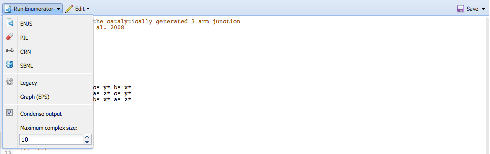

DyNAMiC Intermediate Language (DIL) 
===================================

The DyNAMiC Intermediate Language (DIL) is the intermediate representation generated by the [Nodal compiler](nodal), DyNAMiC. DyNAMiC converts behavioral representations into molecular implementations using a set of pre-defined translation rules; these rules map "node types" to "molecule types." The result of nodal compilation is therefore a segment-level representation of a set of complexes with a number of explicit Watson-Crick complementarity and orthogonality relationships, but no real nucleotide sequences.

The DIL Editor lets you visualize the primary and secondary structure of these complexes, specify sequence constraints for the segments which compose them, and export these structures to various sequence designers.

## Viewing and Editing systems

To design a system from scratch, follow this procedure, guided by the figure:

1. In the *Segments* pane, click "Add" to add several segments (you can edit their names, sequences, or colors if you'd like)
2. In the *Strands* pane, click "Add" to add several strands. 
3. Click the blank space under the "Segments" column (still in the Strands pane), and type a description of the strand. You can either use [DyNAML short notation](dynaml#short-notation) to group segments into domains, or you can just list the segments you wish to use, separated by spaces (e.g. `1 2 3* a 4 x`, etc.); the "Sequence" column should be filled in automatically with the sequence you've just described
4. In the main *Complexes* pane, click "Add" to add a complex; select the new complex and click "Edit" or double-click the complex name to view a pop-up editor for the complex
5. Under "Strand Order", click the box (which says "Click to add"), and type the names of each of the strands you want in the complex, _separated by + signs_.
6. Under "Structure", enter a segment-wise structure for the complex, in dot-parenthesis notation. Once you have entered a valid structure, you should see a preview in the right-hand pane. You can close the complex editor popup once you're done.

The following sections describe the interface in more detail.

### Ribbon

Use the ribbon toolbar to [design sequences](#designing-sequences), explore system [kinetics](#enumerating-reactions), make [thermodynamic calculations](#evaluating-thermodynamics), or export the system to a Scalable Vector Graphics (SVG) file. 

### Complexes pane
The main interface pane displays a grid of complexes. Complexes are displayed as a secondary structure "planar graph." A "View" menu in the lower-right corner of this panel may be used to modify the visualization; bubbles representing the individual nucleotides may be colored according to segment identity, domain identity, or base identity. Alternatively, the bubbles may be hidden and text labels may be used instead.

### Segments pane
Shows the sequences of the segments which compose the system. Segments are discrete regions of sequence complementarity. A segment's sequence can be edited by double clicking on the sequence and typing a new one; the complexes and strands panes will be updated automatically.

### Strands pane
Shows the strands which comprise the system. Strands may not currently be edited directly, but their composite sequence and component segments/domains may be viewed.

### Interactivity
You can mouse over segments in the Segments or Strands pane in order to highlight them elsewhere in the system. This can be useful for tracing where a particular segment has propagated within the system. The segment will be highlighted in yellow, and its complement will be highlighted in blue.

## Designing sequences

From the ribbon, DIL systems may be exported to various sequence designers, including [Web DD](web-dd), [NUPACK](nupack), and [Multisubjective](multisubjective). Clicking these buttons will generate a file and open the requisite sequence designer.

## Enumerating reactions

From the ribbon, DIL systems may be exported to a file readable by the [reaction enumerator](enumerator). Simply click the "Enumerate" button, and an [enumerator](enumerator) tab will open. Then click "Run enumerator" to run the reaction enumerator: 

See the [Enumerator](enumerator) page for details.

## Evaluating thermodynamics

From the ribbon, you can invoke various thermodynamic calculations. Click "Predict" to open a window for analysis using [NUPACK](nupack), or click the arrow to analyze using [Mfold](mfold) or [RNAfold](rnafold). You can use the "MFE Structures" button to open a NUPACK analysis that will examine only single-stranded complexes (the "complex size" parameter is set to 1); the "Pairwise" button will open a NUPACK analysis with the "complex size" parameter set to 2.

