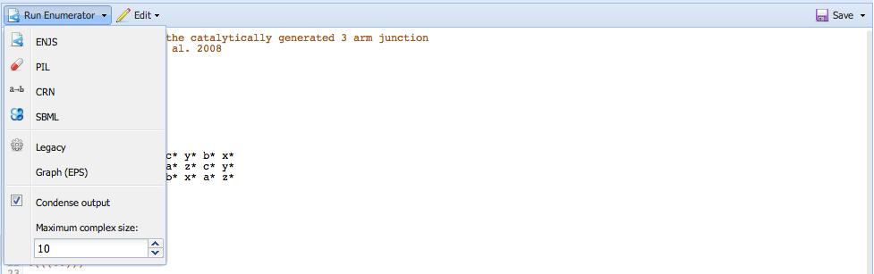
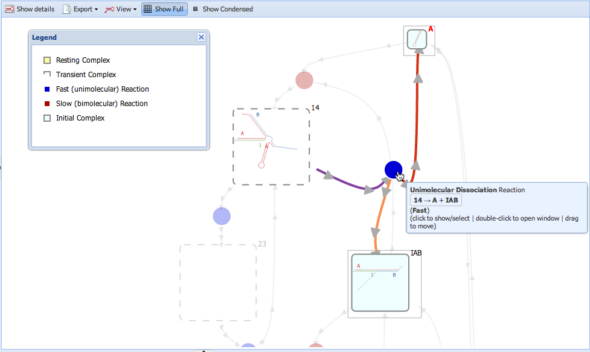
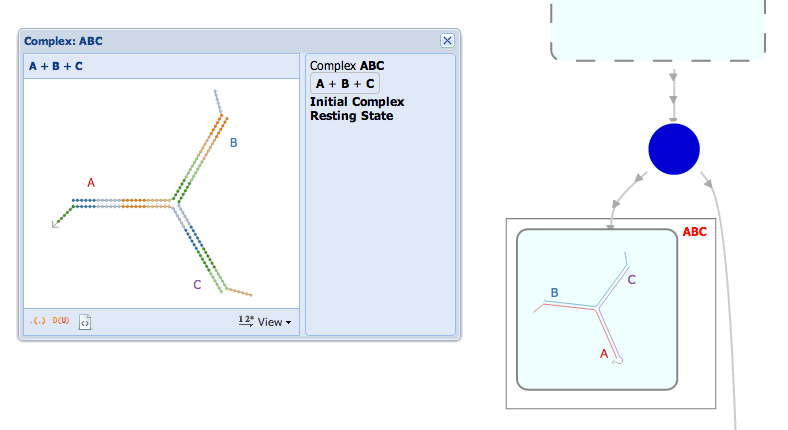
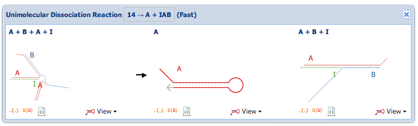
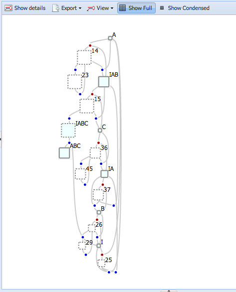
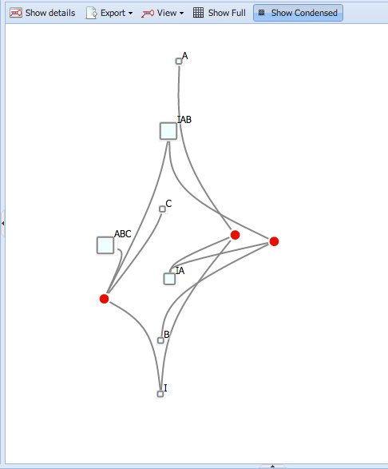
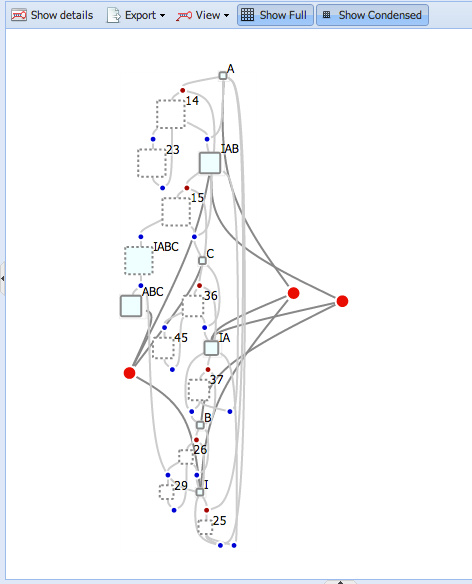

Domain-level reaction enumeration
=================================

*Reaction enumeration* is the process of calculating all possible reactions between, and intermediate complexes formed, from an initial set of complexes. The process proceeds essentially as follows: we beginning with a pool of starting complexes, then calculate all possible "fast" (unimolecular) reactions within this pool. Any complexes (or cycles of complexes) without any outgoing "fast" reactions is deemed a "resting complex;" all other species are designated "transient" Subsequently, "slow" (bimolecular or higher-arity) reactions are then computed between these resting complexes. In DyNAMiC, this process is performed between *domains* (known elsewhere within DyNAMiC as *segments*)---continuous regions of complementarity.[^domains-vs-segments] That is, rather than considering each distinct base pairing as a different secondary structure, reactions are only considered between longer regions of nucleotides. Pseudoknotted intermediates are not considered. 

Once reactions have been enumerated, the enumerator can also generate a "condensed" network of reactions; this network groups all "resting states" (individual resting complexes or cycles of resting complexes connected by fast reactions), and shows only reactions between these resting states. Such a network helps visualize more complex reaction networks by occluding some detail.

The reaction enumerator was originally developed by Karthik Sarma, Brian Wolfe, and Erik Winfree at Caltech, and was also based on algorithms developed by Seung Woo Shin; it has been debugged and extended by Casey Grun at Harvard.

[^domains-vs-segments]: In the [Nodal](nodal) compiler and formalism, a distinction is drawn between *segments* (continuous regions of complementarity), and *domains* (groups of segments with a particular behavioral function, such as input or output). In this sense, the reaction enumerator operates on *segments*; here we use the terms *domain* and *segment* interchangeably to refer to a continuous region of complementary bases.

## Preparing input for the enumerator

The enumerator accepts several text-based input formats:

-	*Standard input format* (`.enum`) – This is a simple format that is specific to the enumerator. A simple example of the format is included below. The format has three types of statements:
	-	`domain` statements declare individual domains, as follows: `domain name : specification`, where:
		-	`name` is the name of the domain (e.g. `a`, `1`, `th`, etc.)
		-	`specification` is either the length of the domain (e.g. a number of bases, or just `long` or `short`) or a sequence (e.g. `NNNNNNN` or `ATTACG` or even a mixture of specific and degenerate bases `AANATCY`)
	-	`strand` statements group domains into strands, as follows: `strand name : domains`, where:
		-	`name` is the name of the strand
		-	`domains` is a space-separated list of domains
	-	`complex` statements group strands into complexes and assign them a secondary structure, as follows:

			complex name :
			strands
			structure

		where:
		-	`name` is the name of the complex
		-	`strands` is a space-separated list of strands
		-	`structure` is a domain-wise description of the structure in dot-parenthesis notation		 

-	[Pepper Intermediate Language](pil) (`.pil`) – PIL is a general-purpose format for describing domain-level secondary structures. See the [PIL](pil) page for details.

Input files for the enumerator can also be generated automatically by the [graphical DIL editor](dil).

Here is a simple example of the standard input format:

	# This file describes the catalytically generated 3 arm junction
	# described in Yin et. al. 2008

	domain a : 6
	domain b : 6
	domain c : 6
	domain x : 6
	domain y : 6
	domain z : 6

	strand I : y* b* x* a*
	strand A : a x b y z* c* y* b* x*
	strand B : b y c z x* a* z* c* y*
	strand C : c z a x y* b* x* a* z*

	complex I :
	I
	....

	complex A :
	A
	.(((..)))

	complex B :
	B
	.(((..)))

	complex C :
	C
	.(((..)))

	complex ABC :
	A B C
	((((((((. + ))))((((. + )))))))).

## Running the enumerator

Once [an input file has been created](files), you can use the "Run enumerator" button to invoke the enumerator. Click the arrow next to the button to select a specific input format or set advanced options:

There are 6 output formats available; you may click any of these menu items to generate output in that format, which will open in a new window:

-	Graphical results (ENJS) – produces a file which can be rendered into a graphical, interactive network by DyNAMiC and exported to SVG. This file is also a valid [JSON](http://www.json.org/) file and may be suitable for consumption by other tools. 
-	Pepper Intermediate Language (PIL) – produces a representation of the network, including reactions, in the [Pepper Intermediate Language](pil)
-	Chemical Reaction Network (CRN) – produces a list of simple reactions between chemical species
-	Systems Biology Markup Language (SBML) – produces a representation using the Systems Biology Markup Language, an industry standard format for modeling biological and chemical networks. SBML can be consumed by a reaction simulator, such as [COPASI](http://www.copasi.org/)
-	Legacy – produces output in the format of Brian Wolfe's old enumerator
-	Graph (EPS) – produces an EPS file showing the reaction network, laid out using [Graphviz](http://www.graphviz.org/)

In addition, the following options may be set:

-	Condense output – Check this box to generate the condensed version of the reaction graph. For the ENJS output format, both the condensed network and the full network of reactions will be viewable; for all other output formats, only the condensed network will be written.
-	Maximum complex size – Select a maximum number of complexes (beyond which the enumeration should be truncated); this allows systems e.g. with potentially infinite polymers to be enumerate in finite time. 

## Viewing enumeration results 

Once enumeration is completed, results should open in a new tab automatically. For the text-based output formats (PIL, CRN, SBML, etc.), this tab will show a text editor. For the graphical output format (ENJS), you should see an interactive, graphical representation of the network:

-	Complexes are represented by rectangles, while reactions are represented by colored circles (*nodes*). Complexes and reactions are connected by grey lines (*links*). Complexes are colored and outlined colored to indicate whether they are initial, resting or transient.
-	You can grab and drag the white background to navigate, and use the mouse wheel to zoom in and out.
-	Mouse-over a complex or reaction to view a description in a tooltip, and to highlight incoming and outgoing links; cool colors show incoming links, while warm colors show outgoing links.
-	Click a complex to show its secondary structure; double-click a complex name or a reaction node to view details of the complex or reaction (see [below](#viewing-complex-and-reaction-details))
-	Complexes, reactions, and lines may be dragged to re-arrange the graph for readability. 
-	Resting states (groups of resting complexes) are outlined in grey

### Enumeration results toolbar

-	*Show Details* – if you click to select a complex or reaction, it will be outlined in red; you can then click "Show Details" to view the complex or reaction details (see [below](#viewing-complex-and-reaction-details))
-	*Export* – you can export the entire reaction graph, in its current view, as a [Scalable Vector Graphics](http://www.w3.org/Graphics/SVG/) (SVG) file which can be viewed or edited in [Adobe Illustrator](http://www.adobe.com/illustrator), [Inkscape](http://www.inkscape.org/), or similar vector graphics programs. 
-	*View* – you can choose to view all secondary structures in the network according to various coloring schemes (e.g. by domain, by strand, or by base identity ) and view options; for instance, you can choose to view or hide labels for all domains and strands, number bases on the backbone, and view bases as lines, text, or circles ("bubbles").
-	*Show Full* – you can toggle whether the full network of uncondensed reactions is displayed
-	*Show Condensed* – you can toggle whether the condensed network of reactions between resting states is displayed

### Viewing complex and reaction details 

If you double-click on a complex name or a reaction node, a small window will open showing details of the object; this is useful if you would like to compare objects on different parts of the network.

 

In complex detail view, you can view the secondary structure of the complex and the constituent strands. You can copy the structure in dot-parenthesis or DU+ notation, or download it as an SVG file. You can apply several view options to the complex as well.

In reaction detail view, you can see a complex preview for each complex in a reaction.

### Viewing full and condensed reactions

Using the *Show Full* and *Show Condensed* buttons in the toolbar, you can choose to view the full reaction graph, the condensed reaction graph, or both overlaid. For the condensed reaction graph, reaction nodes are larger and shown in a lighter color, while links are darker. 

