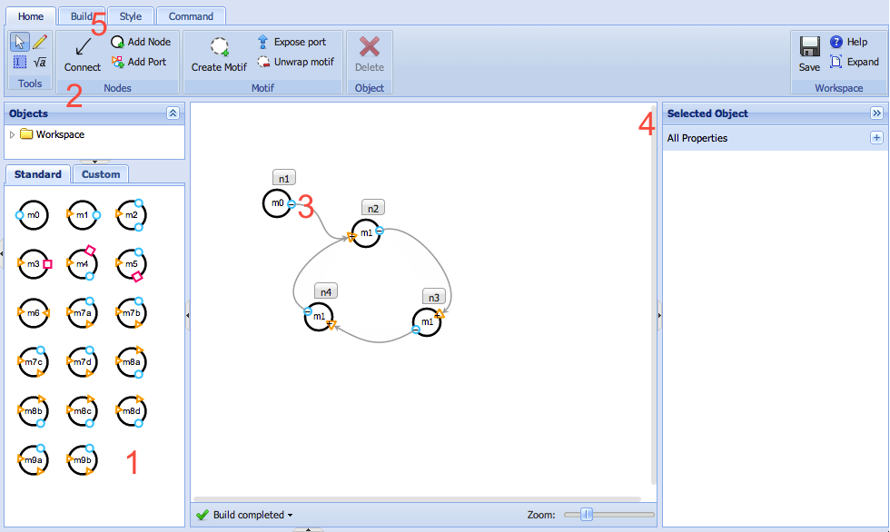
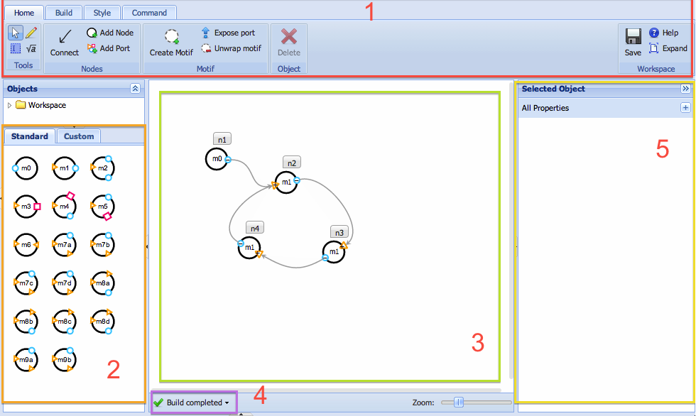

Designing Nodal Systems
=======================

Overview
--------

The nodal formalism allows you to express complicated computational or assembly processes in terms of simple behavioral units, called nodes. Many types of nodes exist---these types are called "motifs," or "node types"; motifs are defined by mapping a structural unit of DNA or RNA (such as a hairpin) to a simple behavioral function. Nodes generally have several _ports_ which correspond to _domains_ of the underlying nucleic acid species. Nodal programs are written by adding instances of motifs (nodes) to a workspace, then connecting the ports together to indicate behavioral relationships. These behavioral relationships in turn imply sequence complementarities. The nodal compiler, called DyNAMiC (the Dynamic Nucleic Acid Mechanism Compiler) propagates those sequence complementarity requirements to generate a list of distinct sequences which must be designed by a sequence designer (such as [DD](web-dd) or [NUPACK](nupack)&nbsp;).

The basic workflow is like this:

-	Nodal systems are assembled using the nodal designer
-	The nodal compiler runs in real-time, verifying the system as you design it.
-	Once your system has been designed you can generate a DIL (DyNAMiC Intermediate Language) file, which represents your system as a scheme of complementarity relationships between segments of the strands in your ensemble (see "Compiling", below)
-	From the DIL file, DyNAMiC can generate input files for many different sequence designers.
-	Sequences can be designed using sequence designers

DyNAMiC actually uses a [JSON](http://json.org/)-based input format, called
[DyNAML](dynaml). You can enter DyNAML directly using the DyNAML editor application, or you can design custom DyNAML motifs from within workbench. The DyNAML language, as well as the Nodal compiler, is described in [this whitepaper](/etc/papers/nodal.pdf).

How to design a nodal system
----------------------------

Here's the quick overview:

1. Drag-and-drop pre-defined node types from the palette on the left
2. Select the "Connect" tool to connect ports together, indicating desired bindings (and thus complementarities) between nodes.
3. Click and drag from the output port (circle) of one node to the input port (triangle) of another.
4. (Optional) Select some node (by clicking on it), then expand the panel over here to examine the molecule that implements the node.
5. Click the "Build" tab, then click "Compile" to generate the system. A new window should pop up showing the segment-level view of your compiled system. [Read about what to do next](dil).

Nodal design interface
----------------------

Here's a bit more detail about different parts of the interface:

1. Ribbon -- perform common actions from here; in particular, use the "Connect" tool to connect ports together, or use the pointer to go back to selecting things. 
2. Palette -- drag-and-drop pre-built node types from here to add them to the workspace (3). If this doesn't work, it might be because you're still using the "Connect" tool; switch back to the pointer (top-left) to add more node types. If you design a custom motif (node type), it will appear under the "Custom" tab.
3. Workspace -- this is where you design systems. 
4. Build status -- the Nodal compiler automatically compiles your system in real-time as you edit it; this icon will show you if you have any errors. If there's an error, the affected node(s) will be highlighted in red, and you can mouse over this button to see the message.
5. Inspector -- select something, then go here to see its properties. For instance, you can select a node and look at its structural implementation.

Read on for more details about different things you might want to do.

Adding Nodes
-------------

You can add nodes to the system by draging and droping existing motifs (node types) from the "Standard" panel in the lower-left, onto the workspace. You can also define new motifs (see [below](#motif-editor)), which will appear in the "Custom" tab of the same panel.

Defining Motifs
---------------

You can create new motifs in two ways, each using the "Create Motif" tool in the ribbon. First, click the "Create Motif" button, then either:

-	Click on the workspace to generate an empty motif. Then select this motif and use the inspector on the right to describe its implementation. You can either:
	-	Click the "Edit Motif" button, and use a graphical interface to define the structure of the motif, or
	-	Expand the "DyNAML Code" box and enter a custom [DyNAML](/etc/papers/nodal.pdf) description. If you want to use one of the built-in motifs as template, click the "Copy from Built-in" button and select a built-in motif from the dropdown menu. 
-	Alternatively, click and drag on the workspace to select and existing system of nodes, and wrap that system in a new motif. 
	-	This will effectively remove those nodes from the system, and transform them into part of the motif. 
	-	All outgoing connections will be removed. 
	-	To "expose" ports within the motif to external complementarities, use the "Add Port" or "Expose" tool:
		-	"Add Port" : Select the "Add Port" tool, then click on the motif to add  a port (hold 'alt' for an input, or 'shift' for a bridge). Then use
			the "Expose" tool to drag from the internal port to the external (motif-level) port
		-	"Expose": Select the "Expose" tool; drag from the internal port to the motif itself; a new port will be created and exposed
	-	You'll need to instantiate the new motif by dragging and dropping it from the "Custom" panel in the lower-left.

If you decide you want to restore the nodes inside a motif to the workspace as normal nodes, select a motif and click the "Unwrap motif" button.

### Using the Motif Editor to edit or define motifs. {#motif-editor}

The Motif Editor is a small graphical tool for defining custom motifs. It can be launched by creating a new motif (see above), selecting the motif in the workspace, and clicking "Edit Motif" in the inspector on the right side. To create a new motif:

-	Start in the "Segments" pane in the top-left. Click the "Add" button to add new segments. You can click the arrow to the right to add segments of different lengths, or to add many specific sequences. 
-	Then use the "Strands" pane to thread segments together into strands. Click "Add" to add a new strand, and then type a strand specification in the DyNAML compact format. You can add as many strands as you'd like.
-	In the "Structure" pane, click the "Strand Order" field and enter the names of your strands, separated by + signs, to describe the order in which the strands should appear in the starting complex. Once your cursor leaves the Strands field, the field will be populated with a simple graphic depicting the segments that comprise the strands you've selected. Note: If you create a strand using the "Strands" pane but don't add the strand name to the "Strand Order" field, it will be omitted from the final motif. 
-	Then, in the "Structure" field, enter the structure for your strand in dot-parenthesis notation. Once a valid structure has been entered, an image of your complex and a depiction of the nodal motif will appear to the right. 

Complementarities
-----------------

To declare complementarities between ports:

-	Select the "Complementarity" tool
-	Drag from one port to another to declare complementarity. You may drag from Input to output, or	Bridge to bridge; other connections will be disallowed. You may also add connections between ports within a motif, but not between ports inside and outside the motif.

Complementarities may only be drawn from output ports to input ports, or between bridge (square) ports. Some connections are not possible, depending on the shape, or "footprint" of the underlying domain. For instance, a connection between a domain with 3 segments: `a b c`, each of length 8, and a domain with 4 segments `a b c d` each of length 4 would be invalid, since the total number of nucleotides (24 and 16) do not match up. Likewise, a connection between a domain with 2 segments `a b` each of length 8 (total length 16) and a domain of one segment `a` of length 16 (total length 16) would _also_ be invalid, since the number of segments in each domain is different. The nodal editor doesn't prohibit these connections from being drawn, but it will highlight the relevant nodes in red and report an error. See "Errors" below for how DyNAMiC and the Nodal editor handle these errors.

You can inspect the footprint of a port by moving your mouse over the port. A small tooltip will appear and will display the length of each segment in the underlying domain

Errors
------

Some connections may be drawn which are invalid. In these cases, DyNAMiC will report an error, and the Nodal interface will indicate this by changing the Build status indicator (in the lower right) to read "Error". You can mouse over this field to view the error message. You can also click the field and select "Check for errors" to recompile the system, or "Show full results" to view the compiled library before sending to a sequence designer.

Compiling
---------

Once your system is assembled, you can generate a picture of the underlying species, and generate input to sequence designers, using the "Build" tool. Select the "Build" tab in the ribbon, then click "Compile". This will generate a new file with the extension `.dil`; this is a DyNAMiC Intermediate Language (DIL) file, and it contains your compiled system. The DIL file will open automatically, and you should see the species used to generate your system. From there, you can send results to one of several sequence designers. See [DIL system editor](dil) for details.

Additionally, you can bypass the DIL step and select "Build all targets" from the dropdown next to the "Compile" button. This generates several files, which will appear as siblings to your system in the files tree:

-	(system)`.dynaml` - A formal, textual representation of your system (in the Dynamic Nucleic Acid Markup Language--DyNAML)
-	(system)`.svg` - A graphical representation of the underlying species in your system
-	(system)`.nupack` - A textual input file for the NUPACK multi-objective thermodynamic sequence designer
-	(system)`.domains` - A textual input file for [WebDD](web-dd)
-	(system)`.pil` - A version of the compiled system in the [Pepper Intermediate Language](pepper) (PIL)

You can select several other options from the drop-down next to the "Compile" button:

-	Clean – Deletes any of the above files in the same directory as your system.
-	Compile with Compiler v2b – Compile with an old version of the compiler
-	Compile locally – Compile in your browser (not on the server); this will not generate any output, but can be used for debugging.
