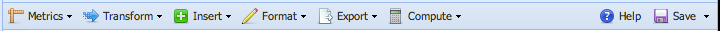

Sequence Editor
===============

Workbench features a powerful text editor for working with DNA sequences. The sequence editor can be accessed from within sequence designers like DD and Multisubjective, by [creating](files) a `.seq` file, or by opening *Tools* > *Sequence Editor* from the main toolbar. 

Most operations in the sequence editor operate on a set of strands. Each separate line is assumed to be on a separate strand; if a single line is selected, sequences separated by spaces or tabs will be treated as different strands. Most operations will replace the selection with the indicated transformation (e.g. selecting "Transform", then "Reverse" will replace the selected sequence with its bases in reverse order). For operations in the "Transform" menu, this can be disabled by unchecking "Replace Selection"; this will cause the transformation to be inserted below each strand.

Within the sequence editor, all operations can be accessed by the menus in the toolbar: 

## Sequence Editor Tools

*	Metrics -- calculate various properties between sequences. Select one or two sequences (separated by newlines, tabs, or spaces), then choose one of these options:
	-	[Levenshtein distance](http://en.wikipedia.org/wiki/Levenshtein_distance) -- Measures the difference between two strings, allowing for substitutions, insertions, and deletions 
	-	[Hamming distance](http://en.wikipedia.org/wiki/Hamming_distance) -- Measures the difference between two strings, allowing only for substitutions
	-	[Shannon entropy](http://en.wikipedia.org/wiki/Entropy_(information_theory)) -- Measures the information entropy of a sequence, giving a metric of base diversity
*	Transform -- modifies the selected sequence. If "Replace selection" is checked, the selection will be replaced with the result of the transformation; else, the result will be inserted on the line below the selection. If multiple lines, or sequences separated by spaces or tabs are selected, each will be handled individually.
	-	Reverse -- reverses the order of a sequence
	-	Complement -- gives the Watson-Crick complement of a sequence
	-	Reverse Complement -- reverses and complements the sequence
	-	Duplicate -- duplicates the sequence
	-	Truncate -- removes bases from the beginning or end of a sequence. Use a positive number to truncate from the left (5' end), use a negative number to truncate from the right (3' end)
	-	To DNA -- replaces uracil (U) bases with thymine (T)
	-	To RNA -- replaces thymine (T) bases with uracil (U) 
	-	Pairwise Align -- attempts to align two sequences to minimize the Levenshtein distance
*	Insert
	-	Insert Poly-X Sequence -- inserts the provided sequence, repeated several times. For instance, specify `N` and `6` to insert `NNNNNN`, or `AT` and `4` to insert `ATATATAT`
	-	Generate Poly-X Sequence -- generates a random sequence according to a pattern of [bases or degenerate bases](#iupac-degenerate-bases) specified (e.g. `NNNN` -> `ATCG`; `YYYY` -> `CTCT`, etc. Specify which base(s) (e.g. A, T, C, G, N, ...) you would like to use; degenerate bases following the IUPAC nucleotide codes are allowed and will be replaced by randomly selected bases matching the specification (e.g N becomes any base, R becomes A or G, Y becomes C or T, etc.). Then specify how many copies of the pattern you would like generated.
*	Format
	-	Strip Extra Characters -- Removes characters other than A, T, C, G, U, and whitespace from the selection
	-	Strip Whitespace -- Removes whitespace characters (spaces, tabs, line returns) from the selection
	-	Strip Newlines -- Removes line return characters from the selection
	-	Insert Line Breaks -- Replaces spaces in the selection with line returns
	-	Uppercase -- Converts the selection to uppercase
	-	Lowercase -- Converts the selection to lowercase
	-	Comment/Uncomment -- Adds/removes comment characters (`#` or `%`); that is, if the selected line(s) begin with a `#` or `%`, removes them; otherwise, inserts a `#` sign before each line.
*	Export
	-	To FASTA -- converts strands named in any format to the [FASTA format](http://www.ncbi.nlm.nih.gov/BLAST/blastcgihelp.shtml) used by the NCBI.
	-	To NUPACK -- converts strands named in any format to the NUPACK script format (e.g. `domain NAME = SEQUENCE`)
	-	To Excel/TSV -- converts strands named in any format to a tab-separated values format, suitable for copy-and-paste into Excel
	-	To CSV -- converts strands named in any format to a comma-separated values format, suitable for reading by many spreadsheet programs
	-	To Plain Text -- removes strand naming
	-	Make DD Input File -- generates an input file for classic DD
	-	Thread Sequences to Strand -- Opens the [sequence threader](utilities#sequence-threading-tool)
	-	Name Strands -- automatically prepends a name, consisting of a prefix and a number, to each sequence on a line. For instance, if the prefix were `n`, lines would be prefixed with `n1 : `, `n2 : `, `n3 : `, etc.
	-	Prepend strands -- prepends each line with some prefix text
*	Calculate -- Allows the partition function and/or MFE secondary structure(s) to be calculated using one of several thermodynamic analysis web servers. See [Analysis and Simulation](simulation-analysis) for details.

## IUPAC Degenerate Bases

The following table lists the IUPAC degenerate base codes recognized by DyNAMiC:

Code  A C G T     Mneumonic
----  - - - -     ----------
A     A           adenosine          
C       C         cytidine             
G         G       guanine
T           T     thymidine          
U           U     uridine 
K         G T     keto         
S       C G       strong         
Y       C   T     pyrimidine 
M     A C         amino        
W     A     T     weak           
R     A   G       purine        
B       C G T     not A             
D     A   G T     not C                
H     A C   T     not G      
V     A C G       not T              
N     A C G T     A/G/C/T (any)        

## Sequence Editor interactivity

In addition to the utilities, the sequence editor will interactively highlight other instances within the design of the selected sequence. The status bar in the lower-right hand corner will show the number of bases and strands (lines) selected.

See also [Working with sequences](sequence).
