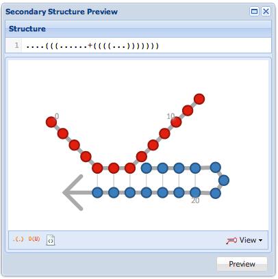
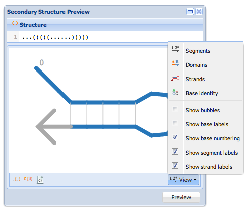
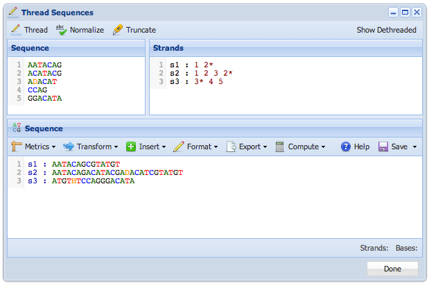

Utilities
=========

Workbench includes several utilities for handling common tasks in DNA system design. You can access these utilities from the "Tools" menu in 

## Structure Editor

Enter a base-wise secondary structure in dot-parenthesis notation. Click "Preview" to update the graphical preview. Use the "View" menu to select various view options. Use the buttons in the lower-left to convert the structure to:

-	Dot-parenthesis notation
-	DU+ notation
-	Scalable Vector Graphics (SVG) -- Exports the current view as an SVG file suitable for editing in programs like Adobe Illustrator or Inkscape. 

### Secondary Structure View Menu

Choose one of four coloring modes, and several additional options from the "View" menu.

There are four coloring modes:

-	Segments -- Color the base bubbles, letters, or backbones based on the segment to which they belong
-	Domains -- Color the base bubbles, letters, or backbones based on the domain to which they belong
-	Strands -- Color the base bubbles, letters, or backbones based on the strand to which they belong
-	Base identity -- Color the base bubbles, letters, or backbones based on the identity of each nucleotide base

Depending on the additional options (below), different features will be shown and colored:

-	Show bubbles -- tick to show each base as a colored circle, or "bubble" (with coloring determined by the mode)
-	Show base labels -- tick to show a letter indicating the base identity of each base. 
-	Show base numbering -- tick to show numerical indices every 10 bases
-	Show segment labels -- tick to show colored labels indicating the location of each segment; these can help you see where segments are, even when the coloring mode is not set to "segments"
-	Show strand labels -- tick to show labels for each strand

If "Show bubbles" is checked, the base bubbles will be colored. If "Show bubbles" is unchecked, but "Show base labels" is checked, the base letters will be colored. If both are unchecked, the backbone will be colored. 

## Sequence Threading Tool

The sequence threading tool can be used to map a set of sequences on to a design. For instance, if you have the following sequences:

	1 : AATACAG
	2 : CCATAG
	3 : GGAATAC

And you wish to arrange these segments into strands as follows:

	s1 : 1 2 3
	s2 : 3* 2* 1*
	s3 : 1 2 3 2*

You could enter the sequences into the left pane, and the strand specifications (in the above format) into the right pane, then click "Thread" to view the full sequences below. Click "Show Dethreaded" to indicate the boundaries between segments in the final sequences shown below. 

## Sequence Editor

[Read more](sequence-edit) about the sequence editor.

